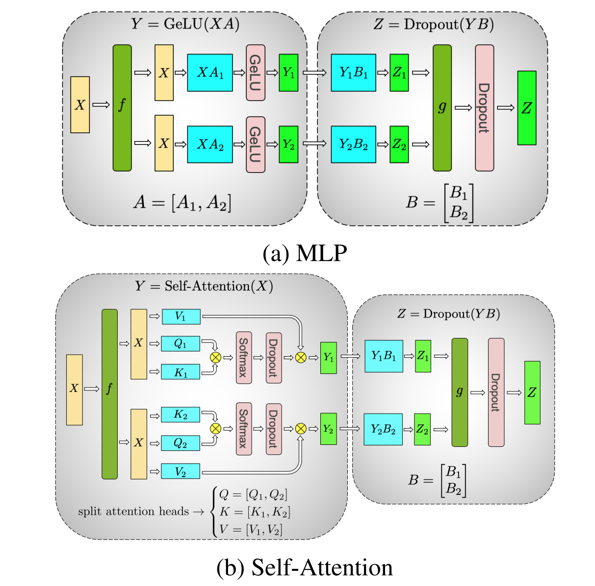

# Megatron张量并行

## 背景与挑战

随着深度学习模型的复杂度与规模持续膨胀，单一计算设备的内存容量及处理能力逐渐成为制约模型训练效率的瓶颈。庞大的模型尺寸不仅超越了单个处理器内存的承载极限，还显著延长了训练周期。为应对这一挑战，亟需将模型进行有效切分，实现跨多台计算设备的并行存储与计算，以提升训练速度并降低内存占用。

## 解决方案

张量并行（Tensor Parallelism，TP）作为模型并行的一种具体实现，通过将模型参数矩阵在多台计算设备间进行切分，有效地分布了模型权重与优化器状态，从而克服了单个计算设备内存容量有限的限制。张量并行不仅显著减少了单设备的内存需求，同时也因各设备仅需处理模型的局部计算，大幅提升了训练速度。
张量并行策略主要包括如下两种切分方式：

* 参数矩阵横切
依据参数矩阵的行方向进行模型切分，此策略要求输入矩阵亦按列进行相应切分。
  + 横切策略前向时，首先对输入矩阵进行切分，各切分后的输入矩阵进入相应的模型部分进行计算，随后利用All-Reduce操作汇总各部分的计算结果，得到最终的前向计算输出。
  + 横切策略反向时，将最终输出的梯度等比例分配给各部分模型的输出梯度，再通过All-Gather操作将各切分输入矩阵的梯度合并，以恢复初始输入矩阵的梯度。
* 参数矩阵纵切
依据参数矩阵的列方向进行模型切分，此时输入矩阵无需切分。

  + 纵切策略前向时，将完整的输入矩阵送入各部分模型，各模型独立完成计算后，通过All-Gather操作拼接各部分的输出结果，形成最终的前向计算输出。
  + 纵切策略反向时，先将最终输出的梯度按比例切分并传递给各部分模型的输出梯度，随后通过All-Reduce操作汇总各部分模型输入矩阵的梯度，以求得初始输入矩阵的梯度。

##### 图1 张量并行示意图

 

## 使用场景

张量并行技术适用于以下场景：

* 内存占用过高：当训练过程中内存占用接近或超过处理器内存限制，导致训练不稳定或无法进行。
* 训练周期冗长：模型规模庞大，单设备训练时间过长，影响研发效率与成本。

## 使用方法
启用张量并行，需在训练脚本中加入以下参数配置：
 `--tensor-model-parallel-size N       # 设置张量模型并行大小，N为单个并行组内的NPU数目`

## 使用效果

通过张量并行策略，利用多台计算设备分担模型存储与计算负荷，不仅显著降低单设备的内存占用，有效缩短了模型训练周期。此外，由于进行了参数的切分，该策略可以解决模型某层参数量较大时，单一计算设备无法全部容纳的问题。
