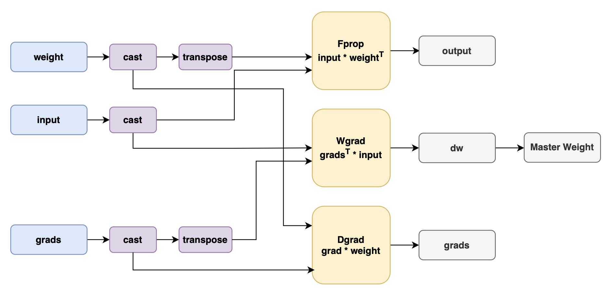

# Megatron Transformer-engine

## 背景与挑战
Transformer Engine (TE) 是一个专门用于加速基于 Transformer 架构的模型进行训练和推理的库。当前的多个第三方框架依赖该加速库提供的API进行推理及训练，MindSpeed需要对这些需求做出对等支持。  
TE支持在昇腾NPU硬件平台使能8位浮点数(FP8)运算，以使用更低的内存提供更佳的性能表现。TE提供了一些Transformer结构的典型模块，以及低精度状态管理器等组件，可以无缝替换基于Megtron-LM构建的大模型，以实现低精度训练。  
MindSpeed提供的TE模块可以无缝替换NVIDIA提供的TE模块，从而更容易构建Transformer层的模块。TE从模块内部维护低精度训练所需要的缩放因子(scale factors)及其他低精度训练的状态值，从而帮助用户更容易地从混合精度训练迁移到低精度训练。  
此外，MindSpeed提供的TE模块还包含了通算融合(Communication Over Computation)的实现,将原本应通信计算串行执行的任务，拆分成更细粒度的子任务，从而将计算和通信相互掩盖以提升效率提高模型吞吐。  

## 解决方法

为了兼容第三方框架对Megatron-TE相关接口的依赖，方便在NPU中进行模型的推理及训练，Mindspeed提供了在Ascend-NPU下等价抽象的TE接口。
目前MindSpeed提供的接口有：
- MindSpeedTELayernorm
- MindSpeedTELayerNormColumnParallelLinear
- MindSpeedTEGroupedLinear
- TEColumnParallelLinear
- TERowParallelLinear

低精度训练流程中主要是将前向传播 (Fprop)、激活反向传播 (Dgrad) 和权重反向传播 (Wgrad)中的GEMM，量化为FP8的精度执行运算。  
整网训练流程仍然是以BF16/FP16的AMP混合精度训练流程，但在特定的计算算子以FP8的精度进行计算，主要是Linear层中的Matmul计算，包括Fprop、Dgrad和Wgrad  
在高精度量化为低精度tensor的过程中，存在着不同的scaling策略:  
- Delayed Scaling:根据历史amax值计算scaling factor，然后使用scaling factor对tensor进行量化。  
- Tensorwise Scaling:在线策略，实时计算amax并应用scaling factor对tensor进行量化。
- Blockwise Scaling:对tensor进行分块，然后分别计算amax并应用scaling factor对tensor进行量化。  
- MX Scaline: 通过块级共享scale与低位宽元素组合，将浮点向量转化为MX块，实现动态量化。  

支持的低精度的数据格式有:  
- E4M3: 1个符号位，4个指数位，3个尾数位，表示范围为-448到+448。
- E5M2: 1个符号位，5个指数位，2个尾数位，表示范围为-57344到+57344。
- HiF8: 1个符号位，动态的Dot位、指数位和尾数位，最大可表示2E15。

## 使用场景
在模型的训练、推理及第三方框架需要使用相关API时，使用Megatron transformer_engine相关接口。

## 使用方法
脚本中设置`--transformer-impl transformer_engine`，即可使用TE分支。同megatron一致，该参数默认值将设置为`transformer_engine`, 如需回溯早期版本行为，请在脚本中额外设置`--transformer-impl local`.  
设置`--fp8-format e4m3`，选择低精度数据格式，目前支持`e4m3`、`hybrid`和`hif8`，开启`hybrid`时，前向训练采用E4M3数据格式，反向传播采用E5M2数据格式。  
设置`--fp8-recipe delayed` 选择低精度训练scaling策略，目前支持`tensorwise`、`delayed`、`mxfp8`和`blockwise`，默认值为`delayed`。

 
**注意**
- `MindSpeedTELayerNormColumnParallelLinear` 支持与 `ascend-mc2` 同时使能，但不支持与 `ascend-coc` 同时使能。
- `MindSpeedTEGroupedLinear` 在部分重构GMM的特性中，如1f1b-overlap等场景下，可能会失效。
- 当前低精度GMM不支持blockwise场景，其他支持策略场景下，低精度训练自动启用低精度GMM计算，如不需要启用，可使能参数`--no-use-gmm-fp8`
- 低精度训练仅支持mcore models，即需要开启`--use-mcore-models`  
- HiF8数据格式训练仅支持tensorwise策略，即需要开启`--fp8-recipe tensorwise`  
- 当前不支持 __低精度通算融合__

## 参数组合限制

<table><thead>
  <tr>
    <th width='120'>TE模块功能</th>
    <th>开启方式</th>
    <th>是否支持</th>
  </tr></thead>
<tbody>
  <tr>
    <td rowspan="5"> 低精度训练</td>
    <td rowspan="5">--transformer-impl transformer_engine
      --fp8-format e4m3/hybrid/hif8
      --fp8-recipe tensorwise/delayed/mxfp8/blockwise </td>
    <td style="text-align: center; vertical-align: middle">✅</td>
  </tr>
<tbody>
  <tr>
    <td rowspan="5"> 通信计算并行</td>
    <td rowspan="5">--transformer-impl transformer_engine
      --use-ascend-mc2 </td>
    <td style="text-align: center; vertical-align: middle">✅</td>
  </tr>
  <tbody>
  <tr>
    <td rowspan="5"> 低精度通算并行</td>
    <td rowspan="5">--transformer-impl transformer_engine
      --fp8-format e4m3/hybrid/hif8
      --fp8-recipe tensorwise/delayed/mxfp8/blockwise 
      --use-ascend-mc2 </td>
    <td style="text-align: center; vertical-align: middle">❌</td>
  </tr>
</table>