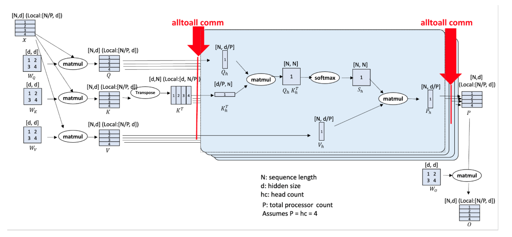

# Ulysses长序列并行

## 背景与挑战

随着AI技术的飞速发展，特别是在生成式AI和科研模型领域，长序列训练的重要性日益凸显。无论是在会话式AI、长文档摘要生成，还是视频内容生成等复杂场景中，系统都需要在广阔的空间和时间维度内对长上下文进行有效推理。此外，章节和书籍级别的庞大文本摘要（涉及数万乃至数十万字的处理）同样对会话式AI和摘要任务提出了严峻的挑战。传统的数据、张量和流水线等并行处理方法在处理长序列时面临显著限制。这些方法往往无法有效扩展以适应序列维度的增加，从而影响了整体系统的性能和效率。

具体来说，传统的并行方法在处理长序列时可能遭遇以下问题：
* 内存限制：随着序列长度的增加，系统所需的内存资源也会成倍增长，导致内存不足。
+ 计算效率：长序列的处理往往需要大量的计算资源，而传统的并行方法可能无法充分利用这些资源，导致计算效率低下。
* 通信开销：在分布式系统中，长序列的处理可能涉及到多个节点之间的通信，而传统的并行方法可能产生较大的通信开销，影响整体性能。

Ulysses长序列并行是一种针对上述挑战设计的创新方案，它能够有效克服内存限制、提高计算效率并减少通信开销，从而显著提升长序列处理的能力。

## 解决方案

支持 Ulysses长序列并行方案，以此解决序列维度扩展问题。

### 解决思路:

首先，Ulysses将各个样本在序列维度上分割给参与的计算设备。然后，在attention计算之前，对已分割的查询（Q）、键（K）和值（V）执行all-to-all通信操作，以便每个计算设备接收完整的序列，但仅用于attention-heads的非重叠子集。这使得参与的计算设备可以并行计算不同的注意力头。最后，Ulysses还可以使用另一个all-to-all在注意力头上收集结果，同时重新在序列维度上进行分区。
具体细节参考文献[DeepSpeed Ulysses: System Optimizations for Enabling Training of Extreme Long Sequence Transformer Models](https://arxiv.org/pdf/2309.14509),执行流程如下图所示:

##### 图1 Ulysses切分原理

 

## 使用场景

num-attention-heads要能够被tensor-model-parallel-size * context-parallel-size整除。
* num-attention-heads：表示注意力头数
* tensor-model-parallel-size：表示张量并行规模
* context-parallel-size：表示长序列并行大小

#### 说明
非--group-query-attention 32k以下场景推荐开启Ulysses长序列并行。

## 使用方法

<table><thead>
  <tr>
    <th width='200'>重要参数</th>
    <th>参数说明</th>

  </tr></thead>
<tbody>
  <tr>
    <td rowspan="7"> --context-parallel-size [int]</td>
    <td>必选，设置长序列并行大小，默认为1，根据用户需求配置。</td>

</tr>
<tbody>
  <tr>
    <td rowspan="7"> --context-parallel-algo<b>    ulysses_cp_algo</b></td>
    <td>可选，设置长序列并行算法。
 
<b>ulysses_cp_algo</b>：开启Ulysses长序列并行，缺省值。
 
hybrid_cp_algo：开启Hybrid长序列并行。
 
megatron_cp_algo：开启Ring Attention长序列并行。</td>

  </tr>
  <tbody></table>

## 使用效果

利用多个计算设备对输入序列进行并行切分，降低单设备的内存消耗，相比不开启序列并行单步耗时增加，相比重计算计算效率提升。

## 鸣谢

1.GitHub项目地址：
https://github.com/microsoft/DeepSpeed/tree/master/blogs/deepspeed-ulysses