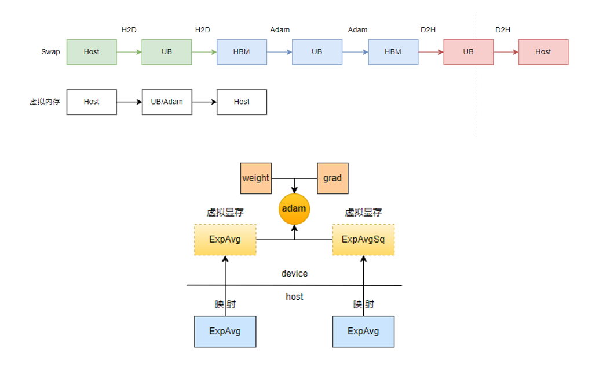

# virtual-optimizer

## 问题分析

在大集群训练中，PP的增大会对前些个stage造成较大的显存压力；同时我们观察到，在增大梯度累积的情况下，优化器部分的一二阶动量显存swap的开销可忽略不计，因此可通过将优化器部分的显存swap到cpu上来节省整网显存，而当前分布式优化器逻辑复杂，并且与各种通信并行（如overlap-grad-reduce/overlap-param-gather等）相互耦合，因此实现一套Swap优化器显存的系统较为复杂。

## 解决方案
为避免引入复杂的Swap系统工程，和多流带来的额外显存与性能开销，借助昇腾驱动的虚拟内存原生能力，可以实现申请一个实际内存在Host侧，但内存地址可被映射在device上的张量，并且该张量可参与绝大多数NPU算子计算（除涉及随路计算的算子），基于此我们可以通过修改一行代码来实现优化器动量的Swap功能：

```python

# before
...
state['exp_avg'] = torch.zeros_like(p, memory_format=torch.preserve_format)
state['exp_avg_sq'] = torch.zeros_like(p, memory_format=torch.preserve_format)
...

# after
...
state['exp_avg'] = torch_npu.empty_with_swapped_memory(p.size(), device=p.device)
state['exp_avg_sq'] = torch_npu.empty_with_swapped_memory(p.size(), device=p.device)
...
```


## 与单纯swap对比

如下为图示对比说明：



**优势分析**：
- 虚拟内存能够节省两次UB与HBM的搬运时长，直接从硬件执行访问。
- 基于虚拟内存的搬运可以利用算子本身的流水机制（MTE2/MTE3/Vector），与计算产生指令级的并行掩盖，避免引入额外的流同步性能与内存的开销（如Swap引入的多流）。

**劣势说明**：申请的Host虚拟内存无法实现随路计算（没有硬件随路计算单元） 


## 使用方法

当需要对优化器部分的显存进行Swap时，有以下几种情况：

1. 希望Swap掉所有的一二阶动量，则可以采用`--virtual-optimizer all`指定。
2. 希望每一个PP Stage Swap同样大小的显存（如我希望每个Stage swap掉2GB的显存），则可以采用`--virtual-optimizer 2.0`指定。
3. 希望每一个PP Stage Swap不同的显存（假设有四个PP Stage，我分别希望Swap掉 6 5 4 3GB的显存），则可以采用`--virtual-optimizer 6 5 4 3`指定。


## 注意事项

- 由于驱动限制，申请为虚拟内存的张量无法被直接访问，因此也无法直接打印和保存，当需要保存或打印时可以借助如下如下函数访问虚拟内存的张量。（注：优化器部分的保存与加载已经适配）

```python
def swap_tensor_copy_wrapper(func):
    def wrapped(*args, **kwargs):
        dst, src = args[0], args[1]
        dst_swap, src_swap = is_swap_tensor(dst), is_swap_tensor(src)
        if dst_swap or src_swap:
            if dst.device == src.device:
                dst.fill_(1).mul_(src)
            elif dst_swap:
                src_npu = src.to(dst.device)
                dst.fill_(1).mul_(src_npu)
            elif src_swap:
                src_npu = torch.ones_like(src).mul(src)
                dst.copy_(src_npu)
            else:
                raise TypeError
        else:
            func(*args, **kwargs) # copy_
    return wrapped
 
 
def swap_tensor_func_wrapper(org_func, func_type):
    def wrapped(*args, **kwargs):
        if is_swap_tensor(args[0]):
            if func_type == "detach":
                detach = org_func(*args, **kwargs)
                setattr(detach, "swap_tensor", True)
                setattr(detach.data, "swap_tensor", True)
                return detach
            src = torch.empty_like(args[0])
            src.copy_(args[0])
            if func_type == "cpu":
                return src.cpu()
            elif func_type == "npu":
                return src
            elif func_type == "clone":
                return src
            else:
                raise ValueError(f"func_type {func_type} not supported")
        else:
            return org_func(*args, **kwargs)
    return wrapped

p = torch.randn(100).npu()
exp_avg_swap = torch_npu.empty_with_swapped_memory(p.size(), device=p.device)
setattr(exp_avg_swap, "swap_tensor", True)

torch.Tensor.copy_ = swap_tensor_copy_wrapper(torch.Tensor.copy_)
torch.Tensor.cpu = swap_tensor_func_wrapper(torch.Tensor.cpu, "cpu")
exp_avg_cpu = exp_avg_swap.cpu()
print(f"exp_avg_cpu: {exp_avg_cpu}")
```

- 该特性的环境依赖最新Driver(25.0.RC1) / CANN(8.1.RC1) / PTA（2025年Q2商发）
