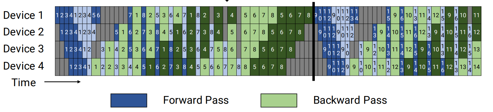

# Megatron虚拟流水线并行

## 背景与挑战

[Megatron流水线并行](./pipeline-parallel.md)策略虽能有效分割模型，但在运行过程中仍存在较高的空泡率，计算资源利用率仍有提高空间。

## 解决方案

为了解决这一问题，虚拟流水线并行技术被提出，旨在通过进一步细分计算任务，降低空泡比率，提升训练效率。

虚拟流水线并行（Virtual Pipeline Parallelism，VPP）的核心在于，在不增加设备数量的前提下，将模型进一步细分为更多阶段，以增加通信量为代价，换取更低的空泡比率。在设备数量不变的情况下，分出更多的流水线阶段，以更多的通信量，换取空泡比率降低。

##### 图1 虚拟流水线并行示意图

[原文链接](https://people.eecs.berkeley.edu/~matei/papers/2021/sc_megatron_lm.pdf)

例如，假设模型总层数为16，张量并行大小为1，流水线并行大小为4，虚拟流水线并行大小为2，则模型将被划分为4 * 2 = 8个阶段，每个阶段包含16 / 8 = 2个层。如下所示：

    Device 0: [1, 2] [9, 10]
    Device 1: [3, 4] [11, 12]
    Device 2: [5, 6] [13, 14]
    Device 3: [7, 8] [15, 16]

前向的顺序为 Device 0 -> Device 1 -> Device 2 -> Device 3 -> Device 0 -> Device 1 -> Device 2 -> Device 3

## 使用场景

鉴于当前数据处理与模型训练过程中存在的性能瓶颈，特别是针对空泡比率（即无效或低效率计算周期占比）的优化需求，虚拟流水线并行技术展现出其独特的优势。该技术旨在通过创新的并行处理机制，有效减少空泡比率，显著提升模型训练的整体性能与效率。具体而言，它能够优化资源分配，加速数据处理流程，从而缩短训练周期，降低计算成本。

## 使用方法
虚拟流水线并行依赖流水线并行。启用虚拟流水线并行，需在训练脚本中加入以下参数配置：
`--num-layers-per-virtual-pipeline-stage  N     # N表示每个虚拟流水线阶段的层数`。

此外，开启该特性时，要求模型总层数L % N == 0，且--pipeline-model-parallel-size大于等于2。
#### 注意：

1. Megatron虚拟流水线并行（VPP）对权重的分割模式具有直接影响。在保存或加载权重文件时，务必保持VPP配置参数的一致性，以确保模型权重的准确加载和系统的稳定运行。

2. 使用verl框架训练时，mbridge与VPP暂不兼容，请在未开启mbridge时使用该特性。

## 使用效果

通过虚拟流水线并行策略，在流水线并行的基础上，成功降低了空泡比率，进一步提升了模型训练的性能和资源利用率。

