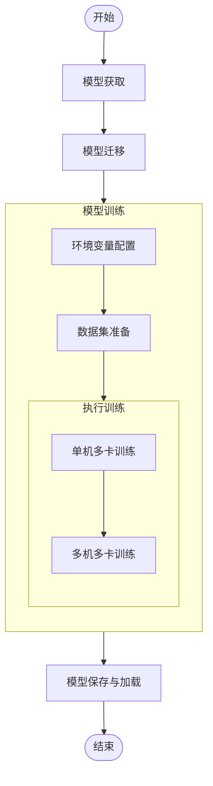
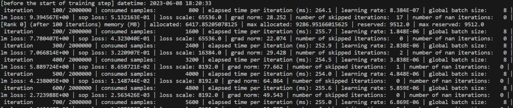

# 分布式训练加速库迁移指南

## 概述

[Megatron-LM](https://github.com/NVIDIA/Megatron-LM)是NVIDIA提出的一种分布式训练加速库，
支持数据并行和模型并行，在大模型训练中得到广泛应用。
经过[MindSpeed](https://gitee.com/ascend/MindSpeed)昇腾平台的兼容性适配，
现已支持在昇腾平台上高效运行。

本手册的主要目标是指导具有一定`Megatron-LM`模型训练基础的用户将原本在其他硬件平台（例如GPU）上训练的模型迁移到昇腾平台（NPU）。

手册内容涵盖模型全流程的迁移方法，
主要关注点是如何有效地将`Megatron-LM`训练模型迁移至昇腾平台上，
并在合理精度误差范围内高性能运行。

本手册面向的读者主要是具有一定深度学习基础与编程经验的研究人员、工程师和开发者：

- 了解深度学习的基本概念和技术，能够使用Python编程语言、Megatron-LM框架进行深度学习模型开发和调试；

- 对深度学习模型的训练和优化有一定的了解，包括训练任务执行与评估，分布式训练，性能数据采集及分析等；

- 对常见的系统性能优化手段有基本认知，例如并行化、编译优化等。

**什么是模型迁移**

模型迁移是指将原本运行在GPU或其他硬件平台的深度学习模型迁移至NPU，
并保障模型在合理精度误差范围内高性能运行。

**为什么进行模型迁移**

将模型从其他硬件平台迁移到NPU时，
由于硬件架构和库的不同，涉及到一系列底层到上层的适配操作。
以GPU为例，模型迁移至NPU需要适配的原因可分为三方面：

- 硬件特性和性能特点差异
由于NPU和GPU的硬件特性和性能特点不同，
模型在NPU上可能需要进一步的性能调试和优化，以充分发挥NPU的潜力。

- 计算架构差异
NVIDIA GPU采用CUDA（Compute Unified Device Architecture）的并行计算架构，
而华为NPU采用CANN（Compute Architecture for Neural Networks）的异构计算架构。

- 深度学习框架差异
为了支持NPU硬件，需要通过`MindSpeed`对`Megatron-LM`框架进行适配：包括适配张量运算、自动微分等功能，以便在NPU上高效执行。

**如何进行模型迁移**

本手册端到端给出了Megatron-LM模型迁移流程指南，
具体请参考[模型迁移总体流程](#模型迁移总体流程)章节。

## 模型迁移总体流程

基于Megatron-LM的模型迁移主要流程如下所示。



## 模型选取

- 选择[Megatron-LM](https://github.com/NVIDIA/Megatron-LM)仓库core_r0.12.1分支，
使用仓库根目录下的pretrain_gpt.py中内置的GPT模型作为迁移的模型。

- 迁移前要保证选定的模型能在三方平台（如GPU）上运行，并输出精度和性能基线。

## 模型迁移

仅仅一行代码就可以轻松使能`MindSpeed`的各项功能，完成对`Megatron-LM`的模型迁移。

**步骤1** 参考[安装指南](./installation.md)完成基础环境的搭建。

**步骤2** 在`Megatron-LM`仓库根目录下修改`pretrain_gpt.py`文件，
在`import torch`下新增一行：

`import mindspeed.megatron_adaptor`

即可完成对`Megatron-LM`模型的适配。

具体修改如下所示。

```python
import os 
import torch
import mindspeed.megatron_adaptor # 新增代码行
from functools import partial
from typing import Union
```

## 模型训练

### 环境变量配置

在终端上执行下述命令进行`Ascend`环境变量的配置，
其中`CANN_INSTALL_PATH`是属于`CANN软件包的安装位置，
需要根据机器上具体情况进行调整。

```shell
source ${CANN_INSTALL_PATH}/ascend-toolkit/set_env.sh
```

### 数据集准备

**步骤1**

下载`vocab.json`和`merges.txt`(https://huggingface.co/Xenova/gpt-3.5-turbo/tree/main)放到`Megatron-LM`仓库根目录下新建的`gpt-tokenizer`目录内，并且分别重命名为`gpt2-vocab.json`和`gpt2-merges.txt`

如果出现下载速度太慢或者无法访问下载的情况，
请配置可用的访问国外网站的代理或者可用的huggingface国内源重试。

**步骤2**

下载Alpaca数据集（https://huggingface.co/datasets/tatsu-lab/alpaca/resolve/main/data/train-00000-of-000010-a09b74b3ef9c3b56.parquet）放到服务器任意目录内，示例目录为`/home/datasets/Alpaca`。

如果出现下载速度太慢或者无法访问下载的情况，
请配置可用的访问国外网站的代理或者可用的huggingface国内源重试。

**步骤3**

读取Alpaca数据集parquet格式的原始语料，
并将其转换为JSON格式，以便后续处理。

在bash终端内执行如下命令完成原始语料处理。

```shell
# 依赖安装
pip3 install nltk pyarrow pandas

cd /home/datasets/Alpaca/
python convert_parquet.py
```

其中convert_parquet.py为`/home/datasets/Alpaca/`目录下的新建文件，
具体代码如下所示：

```python
import json
import pandas as pd
data_df = pd.read_parquet("train-00000-of-00001-a09b74b3ef9c3b56.parquet")
data_df['text'] = data_df['text'].apply(lambda v: json.dumps({"text": v}))
with open("alpaca_json.json", encoding='utf-8', mode='w') as f:
    for i, row in data_df.iterrows():
        f.write(row["text"])
        f.write("\n")
```

如果出现`pip install`无法下载依赖，请配置可用的pip源重试。

**步骤4**

在`Megatron-LM`仓库根目录下执行如下命令进行数据预处理，
将步骤3生成的json格式的数据集转换成`Megatron-LM`识别的数据集格式。

```shell
python tools/preprocess_data.py \
    --input /home/datasets/Alpaca/alpaca_json.json \
    --output-prefix ./gpt_pretrain_data/alpaca \
    --tokenizer-type GPT2BPETokenizer \
    --vocab-file ./gpt-tokenizer/gpt2-vocab.json \
    --merge-file ./gpt-tokenizer/gpt2-merges.txt \
    --append-eod \
    --log-interval 1000 \
    --workers 8
```

执行完成后，将在`gpt_pretrain_data`目录下生成两个文件：`alpaca_text_document.bin`和`alpaca_text_document.idx`。

### 执行训练

#### 单机多卡训练

**步骤1**

在`Megatron-LM`仓库根目录下，新建训练脚本`pretrain_single.sh`。
`pretrain_single.sh`的脚本内容如下所示。

```shell
#!/bin/bash

export CUDA_DEVICE_MAX_CONNECTIONS=1

GPUS_PER_NODE=8 # 每个节点卡数，根据实际情况填写
# Change for multinode config
MASTER_ADDR=localhost # 单机默认localhost，多机填写主节点ip
MASTER_PORT=6000
NNODES=1 # 节点数，单机情况填写1
NODE_RANK=0 # 节点rank，主节点填写0
WORLD_SIZE=$(($GPUS_PER_NODE*$NNODES))

CHECKPOINT_PATH=./ckpt
VOCAB_FILE=./gpt-tokenizer/gpt2-vocab.json # 数据集准备章节步骤1下载的文件，根据实际路径填写
MERGE_FILE=./gpt-tokenizer/gpt2-merges.txt # 数据集准备章节步骤1下载的文件，根据实际路径填写
DATA_PATH=./gpt_pretrain_data/alpaca_text_document # gpt_pretrain_data为数据集准备章节步骤4生成的文件路径，alpaca_text_document为bin和idx文件的共同前缀

# 分布式节点参数
DISTRIBUTED_ARGS="
    --nproc_per_node $GPUS_PER_NODE \
    --nnodes $NNODES \
    --node_rank $NODE_RANK \
    --master_addr $MASTER_ADDR \
    --master_port $MASTER_PORT \
"

# GPT模型参数
GPT_ARGS="
    --num-layers 24 \
    --hidden-size 1024 \ 
    --num-attention-heads 16 \
    --seq-length 1024 \
    --max-position-embeddings 1024 \
    --micro-batch-size 8 \
    --global-batch-size 64 \
    --lr 0.00015 \
    --train-iters 1000 \
    --lr-decay-iters 320000 \
    --lr-decay-style cosine \
    --min-lr 1.0e-5 \
    --weight-decay 1e-2 \
    --lr-warmup-fraction .01 \
    --clip-grad 1.0 \
    --fp16 \
    --transformer-impl local \
"

# 数据集配置
DATA_ARGS="
    --data-path $DATA_PATH \
    --vocab-file $VOCAB_FILE \
    --merge-file $MERGE_FILE \
    --split 949,50,1 \
"

OUTPUT_ARGS="
    --log-interval 100 \
    --save-interval 100 \
    --eval-interval 1000 \
    --eval-iters 10
"

torchrun $DISTRIBUTED_ARGS pretrain_gpt.py \
    $GPT_ARGS \
    $DATA_ARGS \
    $OUTPUT_ARGS \
    --distributed-backend nccl \
    --save $CHECKPOINT_PATH \
    --ckpt-format torch
```

**步骤2**
在终端下运行`bash pretrain_single.sh`。
出现如下每步迭代结果的训练日志表明迁移训练成功。


注意：

从core_r0.10.0版本开始，
`Megatron-LM`和`MindSpeed`大量使用高版本语法的类型注解（Type Annotations），如:

```python
hierarchical_context_parallel_sizes: Optional[list[int]] = None
```

因此，若出现以下报错：

```python
  TypeError: 'type' object is not subscriptable.
```
则需升级python到3.9及以上版本。

**后续处理**

- `pretrain_single.sh`训练脚本默认配置了模型保存路径，
如果需要进行模型加载重新训练，
参考[模型保存与加载](#模型保存与加载)章节完成模型的二次训练。

- 若训练过程中提示部分CUDA接口报错，可能是部分API(算子API或者框架API)不支持引起，
用户可进入[昇腾MindSpeed开源社区](https://gitee.com/ascend/MindSpeed)提出ISSUE求助。

#### 多机多卡训练

这里以双机训练为例。

**前提条件**

在训练前确保两台服务器之间通信正常，无其它进程干扰。
确保环境一致（包括conda环境、cann环境等），代码一致，
均能正常进行单机训练。
确定选择一台机器作为主节点。

**步骤1**

在两台机器的`Megatron-LM`仓库根目录下，
各自新建训练脚本`pretrain_distributed.sh`。
`pretrain_distributed.sh`脚本内容如下所示。

```shell
#!/bin/bash

export CUDA_DEVICE_MAX_CONNECTIONS=1

GPUS_PER_NODE=8 # 每个节点卡数，根据实际情况填写
# Change for multinode config
MASTER_ADDR=xxx.xxx.xxx.xxx # 填写主节点ip
MASTER_PORT=6000
NNODES=2 # 节点数
NODE_RANK=0 # 节点rank，主节点填写0, 从节点填写1
WORLD_SIZE=$(($GPUS_PER_NODE*$NNODES))

CHECKPOINT_PATH=./ckpt
VOCAB_FILE=./gpt-tokenizer/gpt2-vocab.json # 数据集准备章节步骤1下载的文件，根据实际路径填写
MERGE_FILE=./gpt-tokenizer/gpt2-merges.txt # 数据集准备章节步骤1下载的文件，根据实际路径填写
DATA_PATH=./gpt_pretrain_data/alpaca_text_document # gpt_pretrain_data为数据集准备章节步骤4生成的文件路径，alpaca_text_document为bin和idx文件的共同前缀

# 分布式节点参数
DISTRIBUTED_ARGS="
    --nproc_per_node $GPUS_PER_NODE \
    --nnodes $NNODES \
    --node_rank $NODE_RANK \
    --master_addr $MASTER_ADDR \
    --master_port $MASTER_PORT \
"

# GPT模型参数
GPT_ARGS="
    --num-layers 24 \
    --hidden-size 1024 \ 
    --num-attention-heads 16 \
    --seq-length 1024 \
    --max-position-embeddings 1024 \
    --micro-batch-size 8 \
    --global-batch-size 128 \
    --lr 0.00015 \
    --train-iters 1000 \
    --lr-decay-iters 320000 \
    --lr-decay-style cosine \
    --min-lr 1.0e-5 \
    --weight-decay 1e-2 \
    --lr-warmup-fraction .01 \
    --clip-grad 1.0 \
    --fp16 \
    --transformer-impl local \
"

#数据集配置
DATA_ARGS="
    --data-path $DATA_PATH \
    --vocab-file $VOCAB_FILE \
    --merge-file $MERGE_FILE \
    --split 949,50,1 \
"

OUTPUT_ARGS="
    --log-interval 100 \
    --save-interval 100 \
    --eval-interval 1000 \
    --eval-iters 10 \
"

torchrun $DISTRIBUTED_ARGS pretrain_gpt.py \
    $GPT_ARGS \
    $DATA_ARGS \
    $OUTPUT_ARGS \
    --distributed-backend nccl \
    --save $CHECKPOINT_PATH \
    --ckpt-format torch
```

**步骤2**

`Megatron-LM`支持通过设置`data_cache_path`命令行参数设置多台机器共享数据的路径，
未设置`data_cache_path`则表示不使用共享存储功能。

如果**未使用**共享存储，
需要修改两台节点下的`Megatron-LM`仓库的`megatron/core/datasets/gpt_dataset.py`，
具体修改如下所示。

```python
# 原始
if not path_to_cache or (
    not cache_hit
    and (not torch.distributed.is_initialized() or torch.distributed.get_rank() == 0) # 删除这行
)

#修改后
if not path_to_cache or (
    not cache_hit
)
```

**步骤3**

设置两个节点的IP信息，
保证能进行分布式通信。

在**主、从节点**上分别设置`HCCL_IF_IP`为本机IP,
设置命令为：

```shell
export HCCL_IF_IP=xxx.xxx.xxx.xxx
```

在**主、从节点**上使用`ifconfig`查看本机IP对应的网卡，
示例机器查到的网卡为`enp189s0f0`，则设置：

```shell
export GLOO_SOCKET_IFNAME=enp189s0f0
```

**步骤4**

在主节点上执行多机多卡训练脚本。
具体运行命令如下所示：

```shell
bash pretrain_distributed.sh
```

**步骤5**

在从节点执行多机多卡训练脚本。
具体运行命令如下所示：

```shell
bash pretrain_distributed.sh
```

在从节点终端标准输出上观察到下图所示每步迭代结果的训练日志说明多机多卡训练适配完成，
可以停止训练。


注意：

从core_r0.10.0版本开始，
Megatron-LM和MindSpeed大量使用高版本语法的类型注解（Type Annotations），如:

```python
hierarchical_context_parallel_sizes: Optional[list[int]] = None
```

因此，若出现以下报错：

```python
  TypeError: 'type' object is not subscriptable.
```
则需升级python到3.9及以上版本。

**后续处理**

- `pretrain_distributed.sh`训练脚本默认配置了模型保持路径，
如果需要进行模型加载重新训练，
参考[模型保存与加载](#模型保存与加载)章节完成模型的二次训练。

- 若训练过程中提示部分CUDA接口报错，可能是部分API(算子API或者框架API)不支持引起，
用户可进入[昇腾MindSpeed开源社区](https://gitee.com/ascend/MindSpeed)提出ISSUE求助。

## 模型保存与加载

**模型保存**

`Megatron-LM`加速库集成了保存模型功能，
可以使用`--save`参数指定保存路径，
`--save-interval`指定保存间隔。

在[单机多卡训练](#单机多卡训练)章节配置的`pretrain_single.sh`脚本中关于模型保存的配置为：

```shell
CHECKPOINT_PATH=./ckpt
#脚本中其它内容已经省略，主要展示模型保存的配置
torchrun $DISTRIBUTED_ARGS pretrain_gpt.py \
    $GPT_ARGS \
    $DATA_ARGS \
    $OUTPUT_ARGS \
    --distributed-backend nccl \
    --save $CHECKPOINT_PATH \
    --ckpt-format torch
```

执行单机多卡训练后，
在`Megatron-LM`仓库根目录下的`ckpt`文件夹下生成类似`latest_checkpointed_iteration.txt`和
`iter_00000010/mp_rank_00/model_optim_rng.pt`文件说明模型保存成功。

具体保存模型的文件路径名根据用户的配置会有一定差异，
只要出现上述类似层级的文件则说明模型保存成功。

**模型加载**

如果需要使用保存的模型继续训练，
可以使用`--load`参数加载指定路径下的模型，
如在[单机多卡训练](单机多卡训练)中将配置的`pretrain_single.sh`修改为：

```shell
#!/bin/bash

export CUDA_DEVICE_MAX_CONNECTIONS=1

GPUS_PER_NODE=8 # 每个节点卡数，根据实际情况填写
# Change for multinode config
MASTER_ADDR=localhost # 单机默认localhost，多机填写主节点ip
MASTER_PORT=6000
NNODES=1 # 节点数，单机情况填写1
NODE_RANK=0 # 节点rank，主节点填写0
WORLD_SIZE=$(($GPUS_PER_NODE*$NNODES))

CHECKPOINT_PATH=./ckpt
VOCAB_FILE=./gpt-tokenizer/gpt2-vocab.json # 数据集准备章节步骤1下载的文件，根据实际路径填写
MERGE_FILE=./gpt-tokenizer/gpt2-merges.txt # 数据集准备章节步骤1下载的文件，根据实际路径填写
DATA_PATH=./gpt_pretrain_data/alpaca_text_document # gpt_pretrain_data为数据集准备章节步骤4生成的文件路径，alpaca_text_document为bin和idx文件的共同前缀

# 分布式节点参数
DISTRIBUTED_ARGS="
    --nproc_per_node $GPUS_PER_NODE \
    --nnodes $NNODES \
    --node_rank $NODE_RANK \
    --master_addr $MASTER_ADDR \
    --master_port $MASTER_PORT \
"

# GPT模型参数
GPT_ARGS="
    --num-layers 24 \
    --hidden-size 1024 \ 
    --num-attention-heads 16 \
    --seq-length 1024 \
    --max-position-embeddings 1024 \
    --micro-batch-size 8 \
    --global-batch-size 64 \
    --lr 0.00015 \
    --train-iters 1000 \
    --lr-decay-iters 320000 \
    --lr-decay-style cosine \
    --min-lr 1.0e-5 \
    --weight-decay 1e-2 \
    --lr-warmup-fraction .01 \
    --clip-grad 1.0 \
    --fp16 \
    --transformer-impl local \
"

#数据集配置
DATA_ARGS="
    --data-path $DATA_PATH \
    --vocab-file $VOCAB_FILE \
    --merge-file $MERGE_FILE \
    --split 949,50,1 \
"

OUTPUT_ARGS=(
    --log-interval 100
    --save-interval 100
    --eval-interval 1000 
    --eval-iters 10
)

torchrun $DISTRIBUTED_ARGS pretrain_gpt.py \
    $GPT_ARGS \
    $DATA_ARGS \
    $OUTPUT_ARGS \
    --distributed-backend nccl \
    --save $CHECKPOINT_PATH \
    --load $CHECKPOINT_PATH \
    --ckpt-format torch
```

在终端下运行`bash pretrain_single.sh`。
终端标准输出上出现如下每步迭代结果的训练日志表明加载模型重新训练成功。

