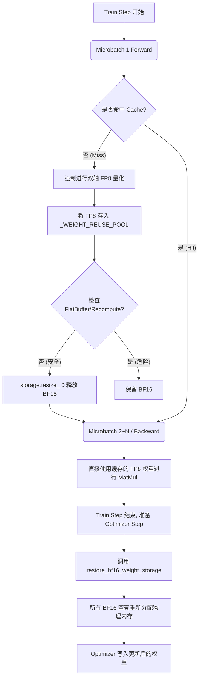

# MindSpeed FP8 零冗余权重 (Zero-Redundancy Weight) 架构设计

## 1. 背景

### 为什么会有权重显存冗余？

在默认的 FP8 训练架构中，模型加载的原始权重是 `BF16` 格式的。
当进行前向传播（Forward）或反向传播（Backward）时，框架会调用 `npu_dynamic_mx_quant` 将 `BF16` 转换为 `FP8` 参与矩阵乘法。

问题就出在这里：

- 转换完成后，生成了新的 FP8 权重（存入了 Reuse Cache 池）。
- 但底层的 **BF16 权重存在显存里**！
- 这意味着在整个极容易 OOM 的前反向计算高峰期，同一份权重在显存中占用了 **BF16 (2 bytes) + FP8 (1 byte) = 3 bytes** 的空间。

---

## 2. 初步想法与最终实现的关系

| 核心痛点与初步想法 | 最终分支里的真实代码落点 | 含义 |
| --- | --- | --- |
| **释放 BF16 显存** | `release_bf16_weight_after_quantization` | 底层调用 `storage.resize_(0)` 瞬间清空物理显存，而不是删除 Tensor 视图。 |
| **恢复 BF16 供优化器更新** | `restore_bf16_weight_storage` | 在 `optimizer_step_reuse_cleanup_wrapper` 边界调用，让 BF16 满血复活。 |
| **拦截 Megatron 的 FlatBuffer** | `storage_size > expected_tensor_bytes` 校验 | 拦截 Megatron 的 FlatBuffer (共享内存)，防止一刀切死整个 Bucket。 |
| **激活重计算/反向重计算** | 不涉及 | 重算与bf16权重释放暂不兼容。 |

---

## 3. 最终架构，一句话版

最终架构可以理解为极其精准的生命周期微操：

1. **量化并榨干**：在 Step 内第一次遇到权重时，强制执行双轴量化产出 FP8 存入缓存，随后立刻 `resize_(0)` 释放 BF16 物理显存。
2. **安全复用**：后续的 Microbatch 与 Backward 直接命中 FP8 缓存，绕过已为空壳的 BF16。
3. **精准复活**：在 `optimizer.step()` 发生的前一刻，将所有记录在案的 0 byte 空壳 Tensor 重新分配回原本的物理大小，迎接梯度更新。

---

## 4. 总体生命周期结构图

---

## 5. 真实显存收益数据

> **核心收益指标：显存净收益 = 对应部分的 BF16 权重物理大小 (2N)**
> *(原理：前向传播完成 FP8 双轴量化与缓存后，立刻释放掉占用 2 bytes 的 BF16 物理显存)*

我们在不同的模型架构和切分策略下进行了严格的探针验证和 Loss 对齐，显存收益与理论推演完美闭环。从**模型全局静态显存大盘（Model States）**的视角来看，本方案的理论显存压降比例约为 **10.5% (2N/19N)**。

详细计算逻辑如下：

**N**：代表模型该部分的参数量。
**分母 (19N 静态显存大盘)**：包含 优化器状态与梯度 (16N) + 原始 BF16 权重 (2N) + FP8 量化缓存权重 (1N)。
**分子 (2N 显存净收益)**：被成功切除并释放的 BF16 物理显存。

（以下为各场景实测数据验证：）

### 5.1 qwen3-32B 模型测试 (2 层验证)

- **配置**：Dense 模型，2 层。BF16 显存收益理论 为 0.75B * 2 约为 1.5GB（由于其他不可量化参数与对齐机制，实际略大）。

Number of parameters in transformer block in billions:  0.75
Number of parameters in embedding layers in billions: 1.24

- **实测数据**：
  - 优化前峰值：`max_allocated: 57307.43 MB`
  - 优化后峰值：`max_allocated: 55447.18 MB`
  - **显存净收益**：**1.86 GB**
- **结果**：Loss 对齐，显存收益符合预期。

### 5.2 qwen3-32B 模型分布式测试 (4 卡 TP=4, 6 层)

- **配置**：Dense 6 层，张量并行 TP=4。总参数 2.93B。BF16 显存收益理论为 2.93*2约为5.8GB
- **实测数据**：
  - 优化前单卡峰值：`max_allocated: 26426.90 MB`
  - 优化后单卡峰值：`max_allocated: 25024.40 MB`
  - **单卡显存净收益**：**1.4 GB** (集群总计收益 5.6 GB)。
- **结果**：TP 切分下显存收益符合预期。

### 5.3 qwen3-30B 模型测试 (2 卡 EP=2, 2 层)

- **配置**：MoE 模型，2 层，专家并行 EP=2。单卡负责 8 个 Expert。BF16 显存收益理论 为 0.75 * 2 约为 1.5GB
- **实测数据**：
  - 优化前单卡峰值：`max_allocated: 41519.62 MB`
  - 优化后单卡峰值：`max_allocated: 40671.62 MB`
  - **单卡显存净收益**：**848 MB**。
- **数据解剖**：单卡分配到的 8 个专家加上 Attention 参数，其实际 BF16 体积正是 848 MB。(集群总计收益 1.6 GB)。
- **结果**：精度 Loss 对齐，显存收益符合预期。
