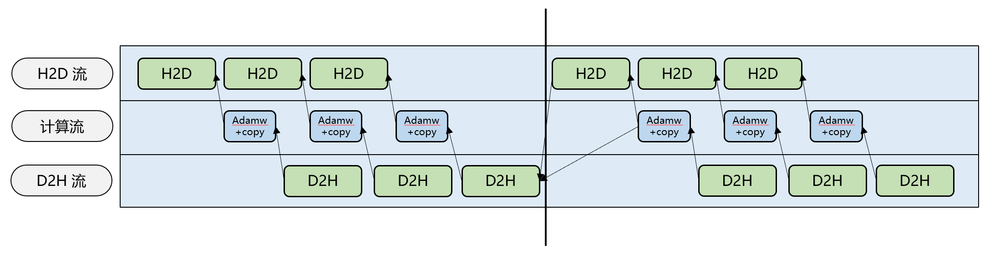

# Swap Optimizer

## 背景与挑战

在大模型训练中，通常会通过BF16格式进行前反向的计算，在梯度更新的时候使用FP32的格式，因此优化器中需要保存一份FP32的权重以及两个FP32的动量，显存占用为`参数量 * 12`Bytes。
这部分显存在前反向阶段并不会被使用，且会推高显存峰值，导致模型训练OOM。虽然可以通过分布式优化器等特性来减少这部分的显存占用，但无法完全消除，且减少比例过于依赖DP数。

## 解决方案

本特性通过在前反向期间，卸载优化器状态到host侧内存，device侧仅保留逻辑视图，在step更新阶段再加载回device侧，来降低显存峰值。

1. 在优化器初始化`shard_fp32_from_float16_groups`的时候，会从模型权重（bf16）复制权重到优化器权重（fp32），为了不冲击显存峰值，需要每复制一份权重就将权重swap到host侧。权重加载的时候同理，每次加载一份权重就进行swap操作，由于只在初始化阶段，因此对性能影响可忽略。

2. 在step阶段，为了h2d和d2h的并行，会先一次性下发大约`numel(shard_fp32_from_float16_groups) // swap_optimizer_times`大小参数的h2d操作，再做AdamW计算以及copy到模型权重（bf16），最后再d2h释放显存。

3. 由于d2h与h2d是异步拷贝，为了保证时序正确，第二轮的d2h需要等前一轮的h2d操作结束之后再下发第二轮。



## 使用场景

使用于使用分布式优化器`--use-distributed-optimizer`且`--optimizer-selection`为`fused_adamw`的模型训练场景。

## 使用方法

- `--swap-optimizer`：开启swap optimizer特性。
- `--swap-optimizer-times`：默认值为16，用于设置step更新阶段进行swap的次数，越小并行的越多，可减少性能劣化，但会提高显存峰值。

推荐配置

```bash
export CPU_AFFINITY_CONF=1,lazy_bind:0
```

此配置启用粗粒度绑核模式，将任务绑定至NPU对应的NUMA CPU核心，可有效避免跨NUMA内存访问，减少调度开销，从而提升计算稳定性与性能。

> [!NOTE]
>
> - 本特性仅适用于开启分布式优化器`--use-distributed-optimizer`且`--optimizer-selection`为`fused_adamw`的模型训练场景。
> - 本特性与 `--reuse-fp32-param`、fused ema adamw优化器等其他优化器相关特性暂不兼容。
