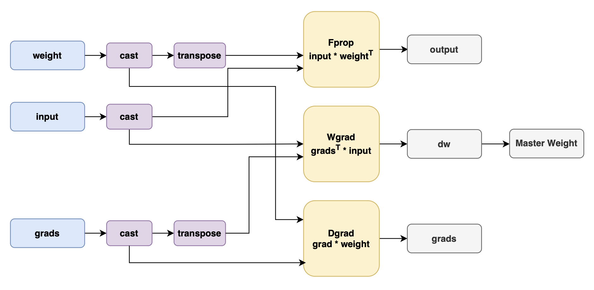

# Megatron Transformer-engine

## 背景与挑战

Transformer Engine (TE) 是一个专门用于加速基于 Transformer 架构的模型进行训练和推理的库。当前的多个第三方框架依赖该加速库提供的API进行推理及训练，MindSpeed需要对这些需求做出对等支持。<!-- codespell:ignore -->
TE支持在昇腾NPU硬件平台使能8位浮点数(FP8)运算，以使用更低的内存提供更佳的性能表现。TE提供了一些Transformer结构的典型模块，以及低精度状态管理器等组件，可以无缝替换基于Megatron-LM构建的大模型，以实现低精度训练。
TransformerEngineNPU 提供的 TE 模块可以替换 NVIDIA 提供的 TE 模块，从而更容易构建Transformer层的模块。TE从模块内部维护低精度训练所需要的缩放因子(scale factors)及其他低精度训练的状态值，从而帮助用户更容易地从混合精度训练迁移到低精度训练。
此外，TransformerEngineNPU 提供的 TE 模块还包含了通算融合(Communication Over Computation)的实现,将原本应通信计算串行执行的任务，拆分成更细粒度的子任务，从而将计算和通信相互掩盖以提升效率提高模型吞吐。

## 解决方法

TransformerEngineNPU 提供昇腾 NPU 上的 TE 接口，MindSpeed 提供 HiF8 / MXFP4 recipe 增强。`transformer_engine.pytorch` 中的主要模块包括：

- `LayerNorm`
- `LayerNormLinear`
- `GroupedLinear`
- `Linear`

低精度训练流程中主要是将前向传播 (Fprop)、激活反向传播 (Dgrad) 和权重反向传播 (Wgrad)中的GEMM，量化为FP8的精度执行运算。
整网训练流程仍然是以BF16/FP16的AMP混合精度训练流程，但在特定的计算算子以FP8的精度进行计算，主要是Linear层中的Matmul计算，包括Fprop、Dgrad和Wgrad
在高精度量化为低精度tensor的过程中，存在着不同的scaling策略:

- Delayed Scaling:根据历史amax值计算scaling factor，然后使用scaling factor对tensor进行量化。
- Tensorwise Scaling:在线策略，实时计算amax并应用scaling factor对tensor进行量化。
- Blockwise Scaling:对tensor进行分块，然后分别计算amax并应用scaling factor对tensor进行量化。
- MX Scaling: 通过块级共享scale与低位宽元素组合，将浮点向量转化为MX块，实现动态量化。

支持的低精度的数据格式有:

- E4M3: 1个符号位，4个指数位，3个尾数位，表示范围为-448到+448。
- E5M2: 1个符号位，5个指数位，2个尾数位，表示范围为-57344到+57344。
- HiF8: 1个符号位，动态的Dot位、指数位和尾数位，最大可表示2E15。

## 使用场景

**后端限制：** 使用 TE 必须设置 `--transformer-impl transformer_engine`（默认值）。

在模型的训练、推理及第三方框架需要使用相关API时，使用Megatron transformer_engine相关接口。

| 能力 | `local` | `transformer_engine` / TENPU |
| --- | --- | --- |
| CP>1 | 不支持 | 支持，按 CP/mask/EOD 类型限制配置 |
| Grouped GEMM | 不支持 | 依赖 TEGroupedMLP，遵守各特性组合限制 |
| FP8/FP4 | 不支持 | 由 TENPU 提供，按 recipe 约束配置 |
| 标准 DSA、GDN 模型构建 | 不支持完整 local 路径 | 投影、归一化等组件依赖 TENPU |

## 使用方法

安装配套 TransformerEngineNPU 和 MegatronAdaptor 后，使用 `--transformer-impl transformer_engine`（默认值）启用 TE。
设置`--fp8-format e4m3`，选择低精度数据格式，目前支持`e4m3`、`hybrid`和`hif8`，开启`hybrid`时，前向训练采用E4M3数据格式，反向传播采用E5M2数据格式。
设置`--fp8-recipe delayed` 选择低精度训练scaling策略，目前支持`tensorwise`、`delayed`、`hif8_delayed`、`mxfp8`和`blockwise`，默认值为`delayed`。

**注意**

- `--use-ascend-mc2` 替换模型中的原生线性层，不覆盖 TENPU TE Linear，详见 [MC2](mc2.md)。Grouped GEMM 的配置见 [MoE GMM](megatron_moe/megatron-moe-gmm.md)。
- 低精度 GMM 当前仅使用 tensorwise、mxfp8、delayed recipe；其他 recipe（含 blockwise、hif8_delayed）回退 BF16 GMM，如不需要启用，可使能参数`--no-use-gmm-fp8`
- FP8 不支持 `--transformer-impl local`。
- HiF8 数据格式支持 `--fp8-recipe tensorwise`、`delayed` 或 `hif8_delayed`；`hif8_delayed` 必须搭配 `--fp8-format hif8`，默认启用 step recovery，使用 `--no-hif8-step-recovery` 关闭，详见 [HiF8 DTS](hif8_dts.md)。
- MXFP4 使用 `--fp4-format e2m1 --fp4-recipe mxfp4`。
- `--fp8-reuse-quantized-weight` 仅在启用 FP8 时有效。
- FP8 通算融合仅支持 MXFP8 recipe 配合 MC2。
- 使用transformer_engine时需同时开启`--use-flash-attn`

## 参数组合限制

<table><thead>
  <tr>
    <th width='120'>TE模块功能</th>
    <th>开启方式</th>
    <th>是否支持</th>
  </tr></thead>
<tbody>
  <tr>
    <td rowspan="5"> 低精度训练</td>
    <td rowspan="5">--transformer-impl transformer_engine
      --fp8-format e4m3/hybrid/hif8
      --fp8-recipe tensorwise/delayed/hif8_delayed/mxfp8/blockwise </td>
    <td style="text-align: center; vertical-align: middle">✅</td>
  </tr>
</tbody>
<tbody>
  <tr>
    <td rowspan="5"> 通信计算并行</td>
    <td rowspan="5">--transformer-impl transformer_engine
      --use-ascend-mc2 </td>
    <td style="text-align: center; vertical-align: middle">✅</td>
  </tr>
  </tbody>
  <tr>
    <td rowspan="5"> 低精度通算并行</td>
    <td rowspan="5">--transformer-impl transformer_engine
      --fp8-format e4m3
      --fp8-recipe mxfp8
      --use-ascend-mc2 </td>
    <td style="text-align: center; vertical-align: middle">✅</td>
  </tr>
</table>
