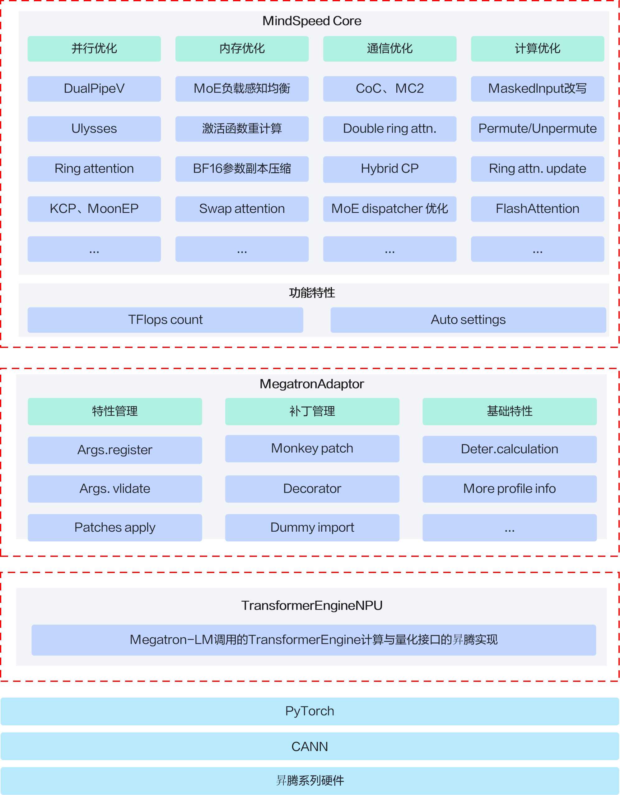

# 简介

## 概述

MindSpeed Core是针对华为昇腾设备的大模型加速库。大模型训练是一种非常复杂的过程，涉及到许多技术和挑战，其中大模型训练需要大量的显存资源是一个难题，对计算卡提出了不小的挑战。当单个计算卡显存资源不足时，可以通过多张计算卡进行计算，业界出现了类似 Megatron、DeepSpeed等第三方大模型加速库，对模型、输入数据等进行切分并分配到不同的计算卡上，最后再通过集合通信对结果进行汇总。昇腾提供MindSpeed Core加速库，使客户大模型业务能快速迁移至昇腾设备，并且支持昇腾专有算法，确保开箱可用。

## MindSpeed Core架构

MindSpeed Core面向NPU的PyTorch训练路径，包含三个基础适配与加速优化组件：

**MA和TENPU是该基础训练方案的必选组件，MindSpeed Core是可选加速组件。** Megatron-LM通过MA完成NPU基础适配，通过TENPU调用TE计算能力。仅使用Megatron-LM + MA + TENPU即可完成基础训练；需要进一步加速时，再安装并启用MindSpeed Core。MindSpeed增强Megatron训练流程，复用MA的特性/补丁管理接口和TENPU的计算模块。

- **MegatronAdaptor（MA）**：负责Megatron-LM的NPU基础适配，提供基础兼容、特性管理与补丁管理接口，供MindSpeed扩展。
- **TransformerEngineNPU（TENPU）**：提供Transformer Engine接口的NPU实现，包括Linear、LayerNorm、DotProductAttention和FP8基础能力，支撑Megatron的TE计算路径。
- **MindSpeed Core**：在MA和TENPU基础上提供并行、内存、通信和计算优化，以及确定性计算、性能分析、并行策略搜索等工具能力。MindSpeed管理自身加速特性和补丁，复用MA提供的扩展机制。

MindSpeed Core提供并行、内存、通信、计算优化及工具、特性与补丁管理能力。MA与TENPU是必选基础支撑：MA适配Megatron-LM，TENPU实现其调用的TE接口。MindSpeed Core复用MA与TENPU的基础能力，按需为训练提供加速优化。MindSpore路径不依赖本图所示的MA/TENPU适配流程，仍按对应文档配置。

图1 MindSpeed架构图

## 功能特性

MindSpeed特性由六大模块组成，分别为并行策略特性、内存优化特性、亲和计算特性、通信优化特性、关键场景特性以及多模态特性。
